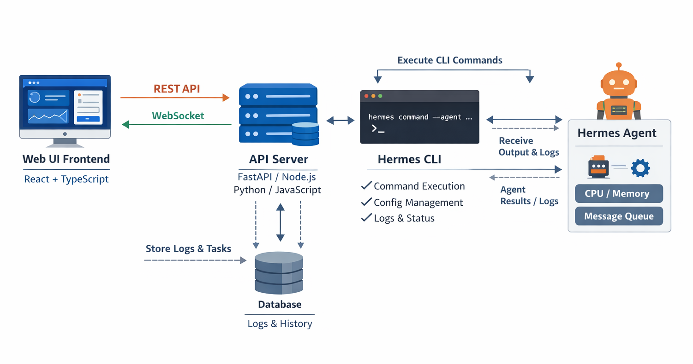

Hermes CLI Web UI 技术方案文档
📖 目录
项目背景

系统架构

技术路线

后端封装实现

前端设计

数据库设计

开发步骤

部署与运维

Docker Compose 示例

总结

📌 项目背景
Hermes CLI 提供了强大的命令行接口，但在实际使用中缺乏直观的可视化管理方式。为了提升易用性和可维护性，本项目目标是构建一个 Web UI 管理平台，通过后端封装 CLI，前端提供交互界面，实现跨平台、可扩展的 Hermes Agent 管理。

🏗 系统架构
[结果似乎无法安全显示。让我们换个方式，尝试其他内容!]

架构说明：

Web UI 前端（React + TypeScript）通过 REST API 和 WebSocket 与后端通信。

API Server（FastAPI 或 Node.js）负责命令执行、配置管理、日志与状态处理。

Hermes CLI 接收后端指令并与 Hermes Agent 交互，执行任务、返回结果与日志。

数据库 用于存储任务与日志，实现可追踪与审计。

⚙️ 技术路线
后端
框架：FastAPI（Python）或 Express（Node.js）

通信协议：REST + WebSocket

安全机制：

命令白名单

参数校验

JWT/OAuth2 权限控制

前端
框架：React + TypeScript

UI 库：Ant Design

状态管理：Redux Toolkit

实时通信：WebSocket 日志流

🔧 后端封装实现
FastAPI 最小示例
python
from fastapi import FastAPI, WebSocket
import subprocess, uuid

app = FastAPI()
tasks = {}

@app.post("/execute")
def execute(command: str, args: list[str] = []):
    task_id = str(uuid.uuid4())
    process = subprocess.Popen(
        ["hermes", command] + args,
        stdout=subprocess.PIPE,
        stderr=subprocess.PIPE,
        text=True
    )
    tasks[task_id] = process
    return {"task_id": task_id, "status": "running"}

@app.websocket("/logs/{task_id}")
async def logs(ws: WebSocket, task_id: str):
    await ws.accept()
    process = tasks.get(task_id)
    if process:
        for line in process.stdout:
            await ws.send_text(line)
    await ws.close()
🎨 前端设计
命令执行面板：输入参数、查看结果

日志流展示：WebSocket 实时输出

配置管理：JSON/YAML 编辑器

任务管理：启动、停止、重启

监控面板：Agent 状态、系统资源

用户管理：登录、权限控制

🗄 数据库设计
表名	字段	说明
tasks	task_id, command, args, status, created_at	任务记录
logs	task_id, timestamp, stdout, stderr	日志记录
users	user_id, role, token	用户权限

🚀 开发步骤
原型设计（Figma）

后端封装 Hermes CLI → REST API

前端开发与日志流展示

集成测试与联调

Docker 化部署

🧩 Docker Compose 示例
yaml
version: "3.9"
services:
  backend:
    build: ./backend
    ports:
      - "8000:8000"
    volumes:
      - ./backend:/app
    command: uvicorn main:app --host 0.0.0.0 --port 8000

  frontend:
    build: ./frontend
    ports:
      - "3000:3000"
    volumes:
      - ./frontend:/app
    command: npm start

  db:
    image: postgres:15
    environment:
      POSTGRES_USER: hermes
      POSTGRES_PASSWORD: hermes123
      POSTGRES_DB: hermesdb
    ports:
      - "5432:5432"
🧠 部署与运维
日志审计：命令执行记录入库

监控：Prometheus + Grafana

扩展接口：技能管理、学习循环

多平台支持：Windows/Linux/Mac

✅ 总结
本方案通过 后端封装 Hermes CLI → 前端 Web UI 管理平台 的技术路线，实现了安全、直观、可扩展的 Hermes Agent 管理工具。它不仅能满足日常操作需求，还为未来扩展（技能管理、学习循环）预留了接口。